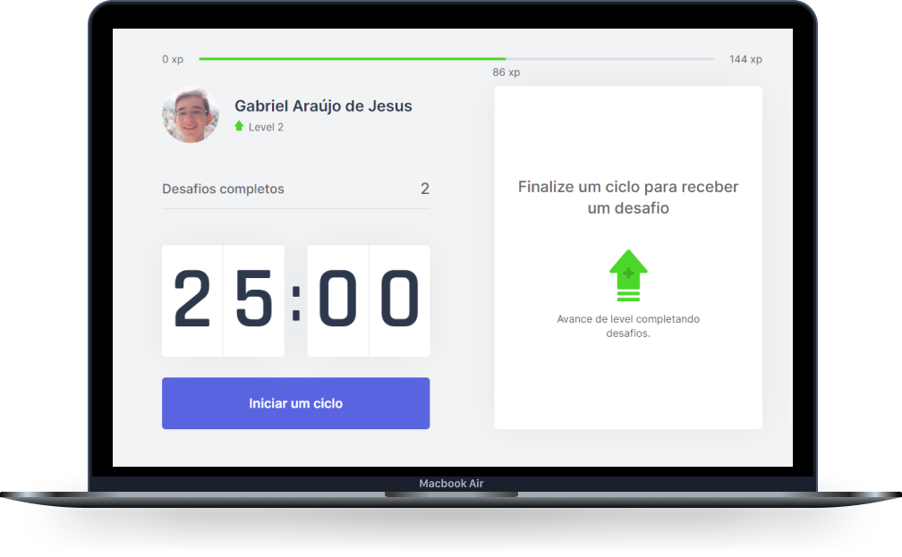

<h1 align="center">
  
</h1>

<h4 align="center">
  🚀 Next Level Week 4.0
</h4>

    <a href="#-projeto">Projeto</a>&nbsp;&nbsp;&nbsp;|&nbsp;&nbsp;&nbsp;
    <a href="#-tecnologias">Tecnologias</a>&nbsp;&nbsp;&nbsp;|&nbsp;&nbsp;&nbsp;
    <a href="#-desafios">Desafios</a>

 

  

## 💻 Projeto

O Move.It é um projeto que visa melhorar a produtividade das pessoas, principalmente de devs. Utilizando a estratégia de pomodoro que é feita em ciclos 25 minutos de alta concentração. Após os 25 minutos de foco, desafios com o objetivo de aprimorar a saúde do usuário, são enviados, e ao completar os desafios o usuário recebe uma quantidade de XP, aumentando o seu nível.

## 🚀 Tecnologias

- [Next.js](https://nextjs.org/)
- [React](https://reactjs.org)
- [Typescript](https://www.typescriptlang.org/)

## 🧠 Desafios

- [x] Layout 2.0;
